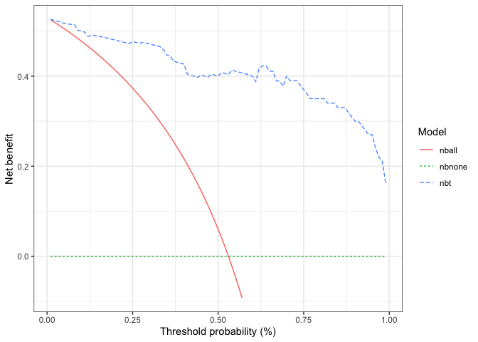
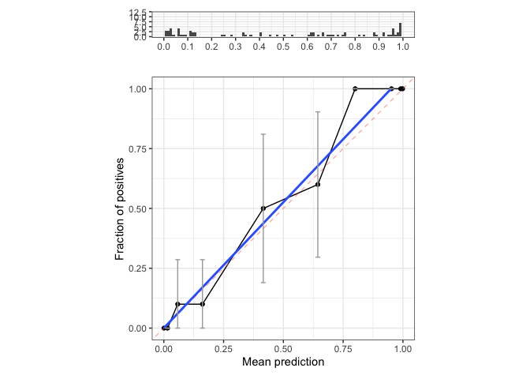
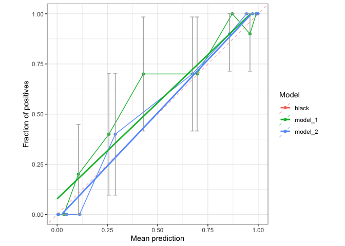
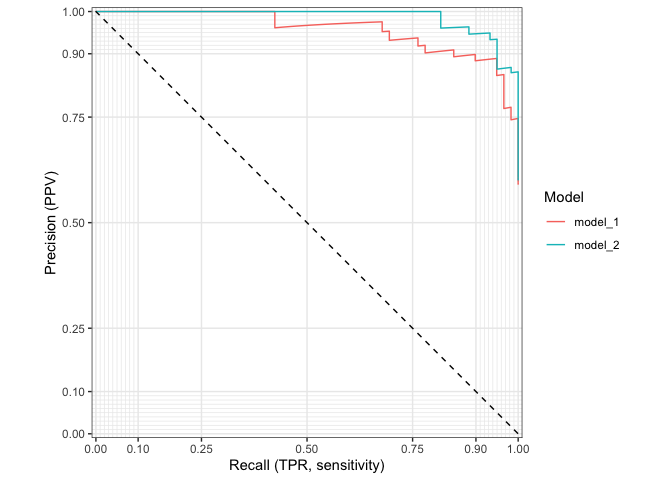
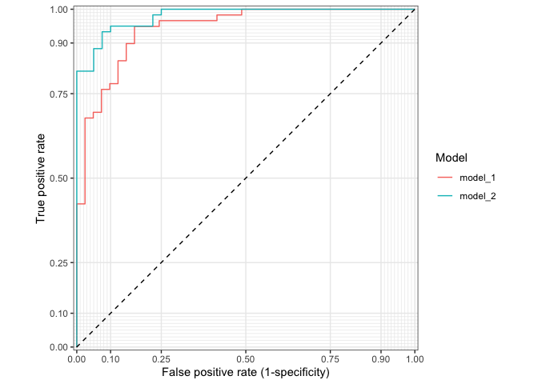

<!-- README.md is generated from README.Rmd. Please edit that file -->

# NoBodySorrow package

<!-- badges: start -->
<!-- badges: end -->

NoBodySorrow (nbs) is an R package with a range of functions to improve
programming workflow in R.

## Installation

``` r
detach(package:nbs, unload=TRUE)
library(utils)
remove.packages("nbs")
devtools::install_github("mikeniemant/nbs")
```

# Load package

``` r
library(nbs)
library(tidymodels)
#> Registered S3 method overwritten by 'tune':
#>   method                   from   
#>   required_pkgs.model_spec parsnip
#> ── Attaching packages ────────────────────────────────────── tidymodels 0.1.4 ──
#> ✓ broom        0.7.10     ✓ recipes      0.1.17
#> ✓ dials        0.0.10     ✓ rsample      0.1.1 
#> ✓ dplyr        1.0.7      ✓ tibble       3.1.6 
#> ✓ ggplot2      3.3.5      ✓ tidyr        1.1.4 
#> ✓ infer        1.0.0      ✓ tune         0.1.6 
#> ✓ modeldata    0.1.1      ✓ workflows    0.2.4 
#> ✓ parsnip      0.1.7      ✓ workflowsets 0.1.0 
#> ✓ purrr        0.3.4      ✓ yardstick    0.0.9
#> ── Conflicts ───────────────────────────────────────── tidymodels_conflicts() ──
#> x purrr::discard() masks scales::discard()
#> x dplyr::filter()  masks stats::filter()
#> x dplyr::lag()     masks stats::lag()
#> x recipes::step()  masks stats::step()
#> • Dig deeper into tidy modeling with R at https://www.tmwr.org
ggplot2::theme_set(ggplot2::theme_bw())
```

# Dummy datasets

## single model tibble

``` r
data(single_model_tibble)
single_model_tibble
#> # A tibble: 100 × 2
#>    y       pred
#>    <fct>  <dbl>
#>  1 1     0.998 
#>  2 1     0.981 
#>  3 0     0.0770
#>  4 1     0.998 
#>  5 1     0.602 
#>  6 1     0.955 
#>  7 0     0.131 
#>  8 1     0.348 
#>  9 1     0.987 
#> 10 0     0.112 
#> # … with 90 more rows
```

## multi model tibble

``` r
data(multi_model_tibble)
multi_model_tibble
#> # A tibble: 200 × 3
#>    model   y      pred
#>    <chr>   <fct> <dbl>
#>  1 model_1 1     0.971
#>  2 model_1 1     0.359
#>  3 model_1 1     0.842
#>  4 model_1 1     1.00 
#>  5 model_1 1     0.641
#>  6 model_1 1     0.733
#>  7 model_1 0     0.273
#>  8 model_1 1     0.982
#>  9 model_1 1     0.994
#> 10 model_1 0     0.734
#> # … with 190 more rows
```

# Functions

## computeBaseNetBenefit

``` r
base_nbt <- computeBaseNetBenefit(single_model_tibble$y)
```

## computeNetBenefit

``` r
nbt <- computeNetBenefit(pt = base_nbt$pt, 
                         y = single_model_tibble$y, 
                         pred = single_model_tibble$pred)

nbt <- base_nbt %>% # TODO: should be the original data frame
  left_join(nbt,
            by = "pt")

ggplot(nbt %>% 
         pivot_longer(cols = -pt, names_to = "model", values_to = "nbt") %>% 
         filter(nbt >= -0.1),
       aes(x = pt, y = nbt, colour = model, linetype = model)) + 
  geom_line() +
  labs(x = "Threshold probability (%)",
       y = "Net benefit",
       colour = "Model",
       linetype = "Model")
```



## computeCalibration

``` r
computeCalibration(labs = single_model_tibble$y, preds = single_model_tibble$pred, event_level = "1")
#> Warning: Removed 2 rows containing missing values (geom_bar).
#> `geom_smooth()` using formula 'y ~ x'
#> Warning: Removed 4 rows containing missing values (geom_smooth).
```



    #> # A tibble: 10 × 7
    #>    preds_cut          data                  n obs_frac mean_pred   lci   uci
    #>    <fct>              <list>            <dbl>    <dbl>     <dbl> <dbl> <dbl>
    #>  1 [3.12e-05,0.00323] <tibble [10 × 2]>    10      0    0.000637 0     0    
    #>  2 (0.00323,0.0282]   <tibble [10 × 2]>    10      0    0.0154   0     0    
    #>  3 (0.0282,0.104]     <tibble [10 × 2]>    10      0.1  0.0580   0     0.286
    #>  4 (0.104,0.31]       <tibble [10 × 2]>    10      0.1  0.161    0     0.286
    #>  5 (0.31,0.571]       <tibble [10 × 2]>    10      0.5  0.416    0.190 0.810
    #>  6 (0.571,0.697]      <tibble [10 × 2]>    10      0.6  0.644    0.296 0.904
    #>  7 (0.697,0.899]      <tibble [10 × 2]>    10      1    0.800    1     1    
    #>  8 (0.899,0.982]      <tibble [10 × 2]>    10      1    0.952    1     1    
    #>  9 (0.982,0.996]      <tibble [10 × 2]>    10      1    0.991    1     1    
    #> 10 (0.996,1]          <tibble [10 × 2]>    10      1    0.998    1     1

## plotCalibration

``` r
dat <- multi_model_tibble %>% 
  nest(dat = c(y, pred)) %>% 
  mutate(cal = map(dat, ~ computeCalibration(labs = .x$y,
                                             preds = .x$pred,
                                             event_level = "1",
                                             plot = F)))

# Plot calibration curve for all models
plotCalibration(dat %>% 
  unnest(cal))
#> `geom_smooth()` using formula 'y ~ x'
#> Warning: Removed 8 rows containing missing values (geom_smooth).
```


TODO: - Set alpha geom\_smooth

## plotPrc

``` r
dat <- multi_model_tibble %>% 
  nest(dat = c(y, pred)) %>% 
  mutate(pr = map(dat, ~ .x %>% pr_curve(pred, truth = y, event_level = "second"))) %>% 
  unnest(pr)
plotPrc(dat)
```



## plotRoc

``` r
dat <- multi_model_tibble %>% 
  nest(dat = c(y, pred)) %>% 
  mutate(roc = map(dat, ~ .x %>% roc_curve(pred, truth = y, event_level = "second"))) %>% 
  unnest(roc)
plotRoc(dat)
```



## cws

Clear work space - Remove all objects in environment - (Close any SQL
connections) - (Close all clusters)

## findTodo

Find all `#TODO` statements in all .R and .Rmd files in a directory.

## replacePattern

Finds and replaces a particular pattern in all .R and .Rmd files in a
directory.

# Notes

Open a new issue [here](https://github.com/mikeniemant/nbs/issues) for
any bug reports or feature requests.

Copyright (C) Michael Niemantsverdriet, the Netherlands, 2022, all
rights reserved. Use for personal and educational purposes.
